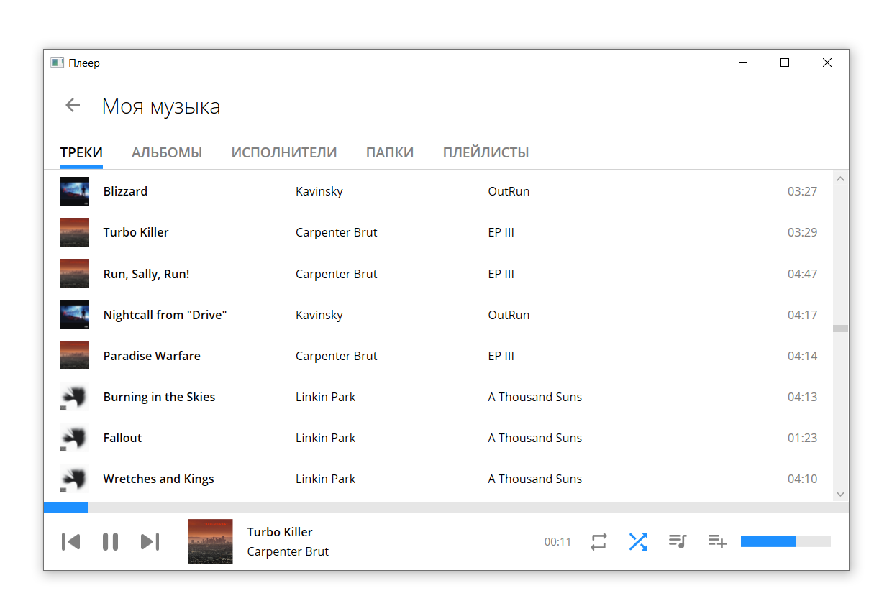
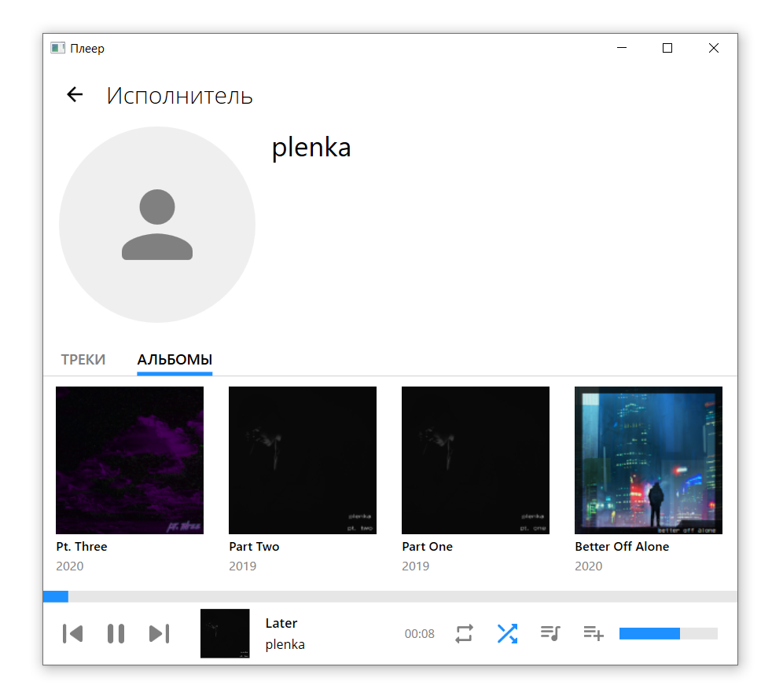
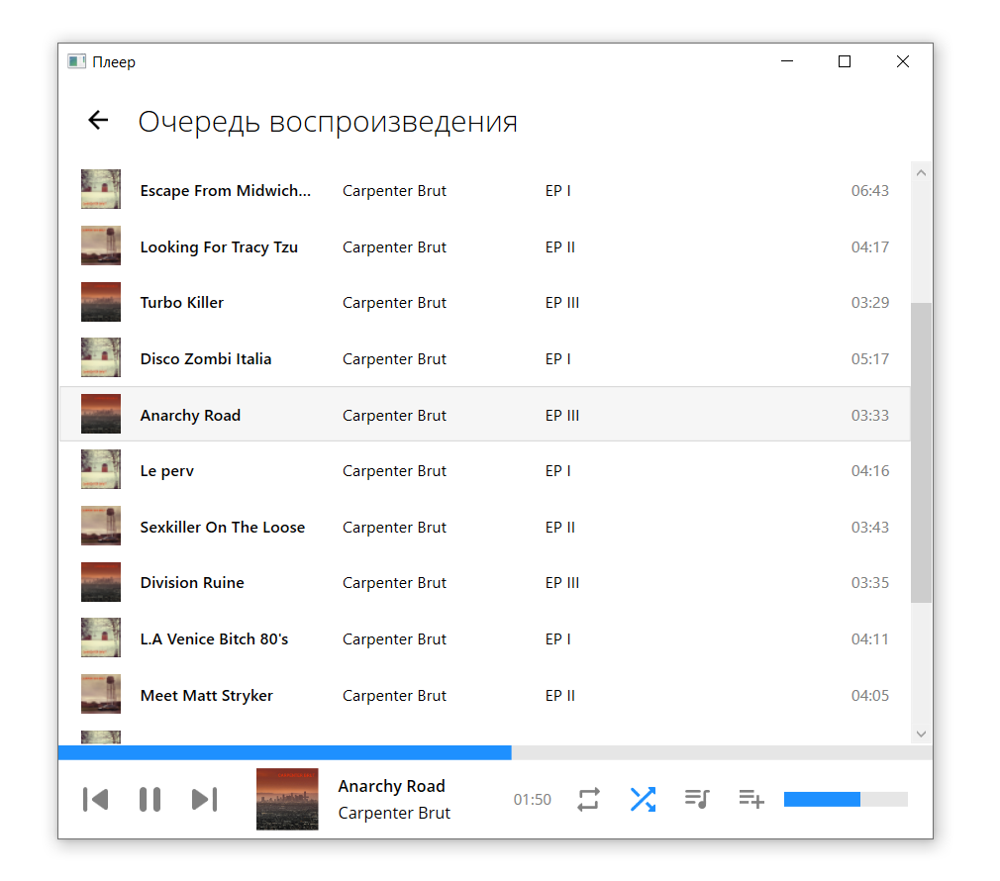

# Курсач
Этот проект был выполнен в качестве курсовой работы за 1 курс (2 семестр) по предмету "Технологии программирования"

### Возможности v1.0
- Проигрывание музыки из какой-то одной корневой папки
- Просмотр всей библиотеки по трекам/альбомам/исполнителям/папкам
- Плейлисты (крайне сыро)

### Другие скриншоты

